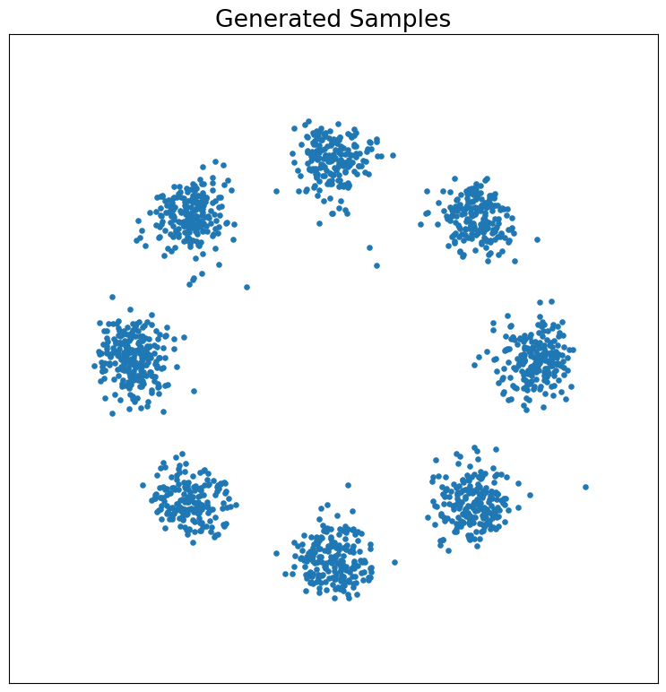
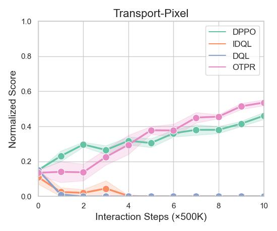
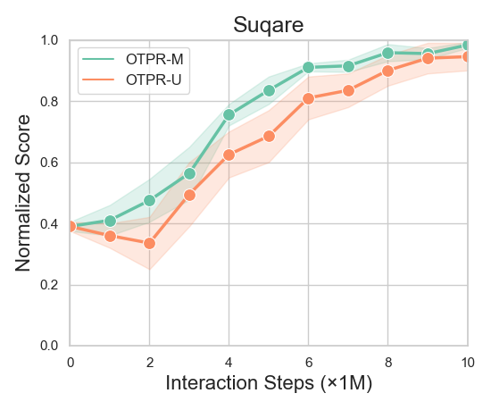

# 1. Qualitative Toy Experiments

**Figure 1.1** **Left:** A continuous Gaussian source distribution (colored level sets) and a multi-modal target samples from 8Gaussian distribution (yellow).
 **Middle:** Samples from source distribution (yellow), paired samples (green) and unpired samples (blue) from target distribution. **Right:** Generated samples by approximating the barycentric projection of the OT plan.
<table>
<tr>
<td>

</td>
<td>

</td>
<td>

</td>
</tr>
</table>

**Figure 1.2** Illustration of the 8gaussians and swissroll dataset (left) and the generation result of diffusion model (right).
<table>
<tr>
<td>

</td>
<td>

</td>
</tr>
<td>

</td>
<td>

</td>
</tr>
</table>

# 2. Pixel-based Romomimic Tasks
**Figure 2** Learning curves of online fine-tuning with various methods on pixel-based romomimic tasks.
<table>
<tr>
<td>

</td>
<td>

</td>
<td>

</td>
</tr>
</table>

# 3. Reporting of Wall-Clock Times
**Table 1** Wall-clock time for 1e6 timesteps during training in ROBOMIMIC tasks.
|     | OTPR | DPPO     | IDQL| DQL |
| :---        |    :----:   |          :---: |   :---: | ---: |
| Robomimic-Can     | 26.5min      | 24.6min   | 23.3min| 21.2min |
| Robomimic-Square   | 54.4min        | 50.8min      | 49.2min| 50.3min |
<!-- | Franka-Kitchen-complete   | 75.4min      | 67.8min  | 67.1min | 64.1min | -->

# 4. Additional Ablation Experiment Result
**Figure 4** Comparison between OTPR with (OTPR-M) and without (OTPR-U) the expert data mask on Robomimic-Square.
<table>
<tr>
<td>

</td>
</tr>
</table>

# 5. Experiment Result on Libero Benchmark (Updating)
 Table 2 Success rate of online fine-tuning on 10 task in Libero-Long.
|  Libero-Long   | Task 1 | Task 2    | Task 3| Task 4| Task 5| Task 6 | Task 7    | Task 8| Task 9| Task 10|
| :---        |    :----:   |          :---: |    :----:   |          :---:|         :---:|    :----:   |   :---:|   :---: | :---: | ---: |
| DP   |  0.85    |  0.7 |   0.9   | 0.85 |    0.7   | 0.9 |   0.6   | 0.7 | 0.1 | 0.7 |
| OTPR   |  0.9    |  0.85 |   0.9   | 1.0  |  0.9     |1.0 |   0.8   | 0.95 | 0.35 | 0.85 |