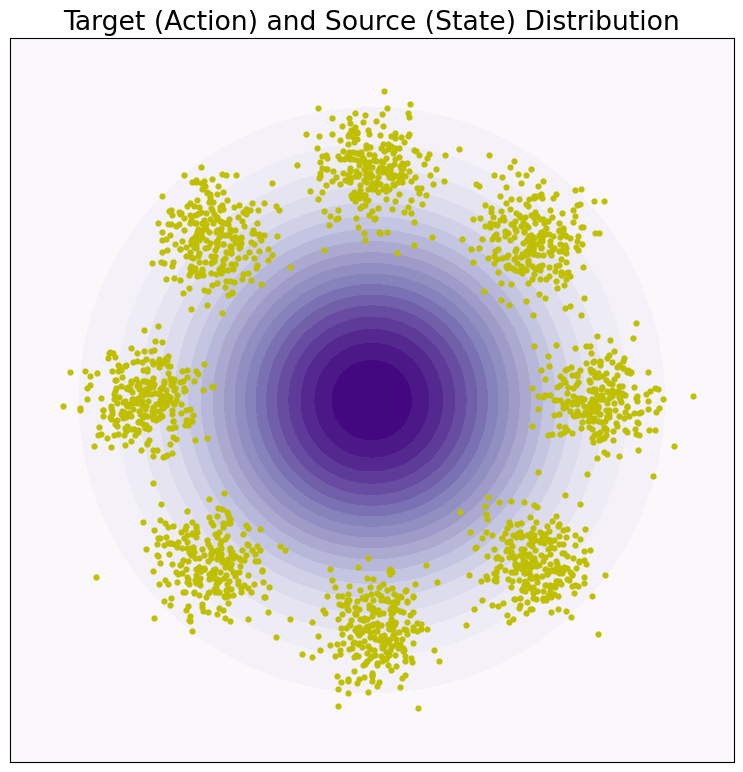
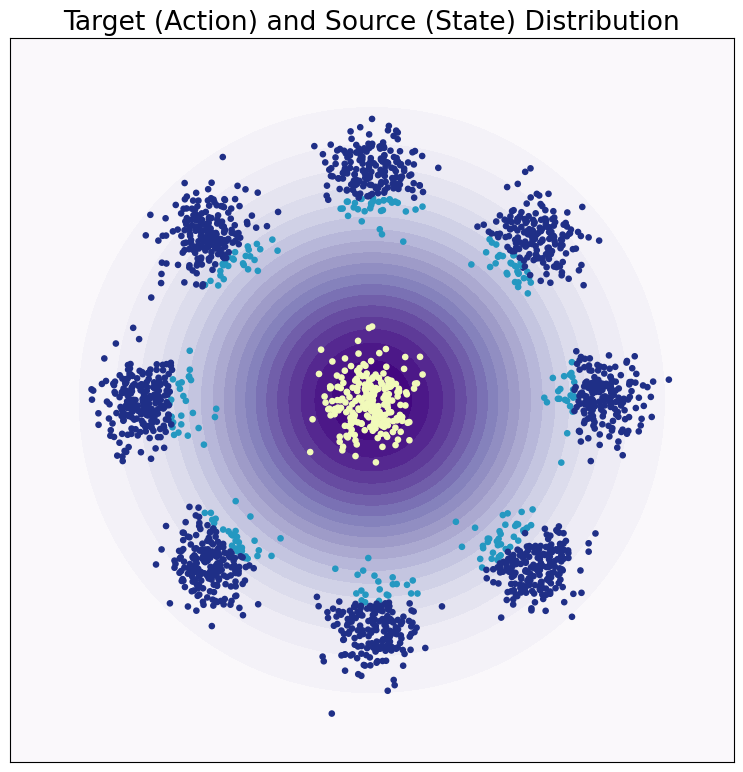
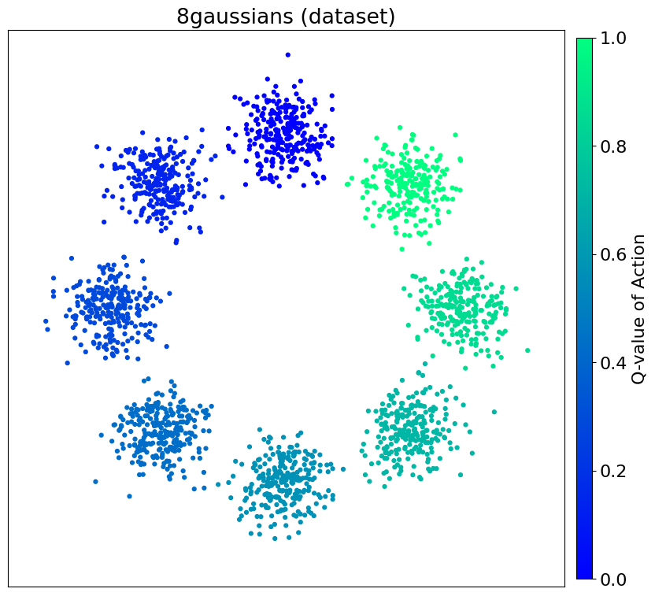
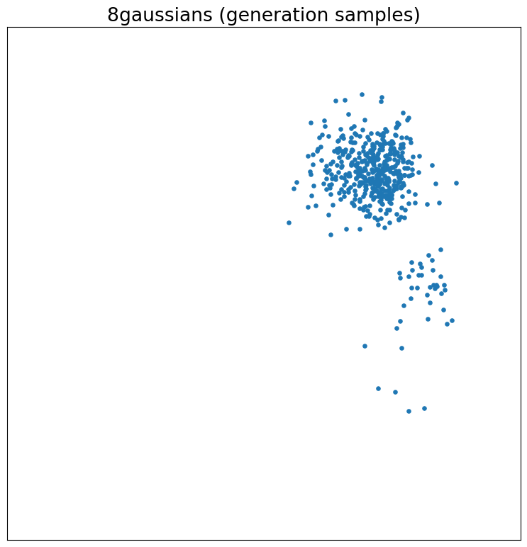
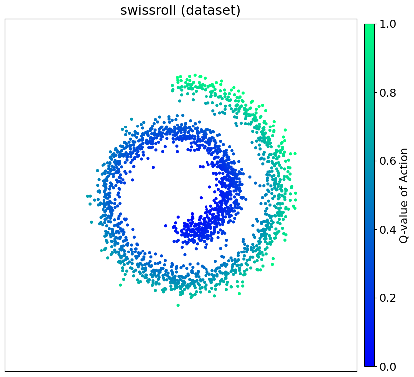
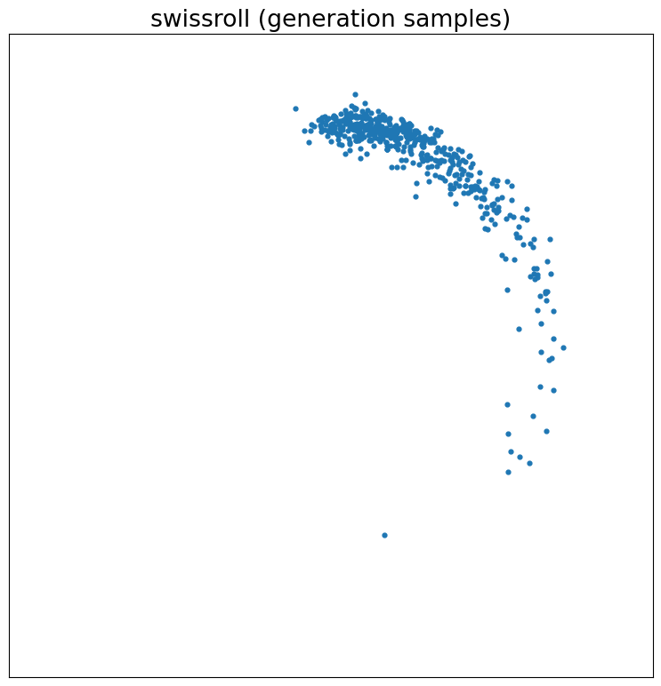
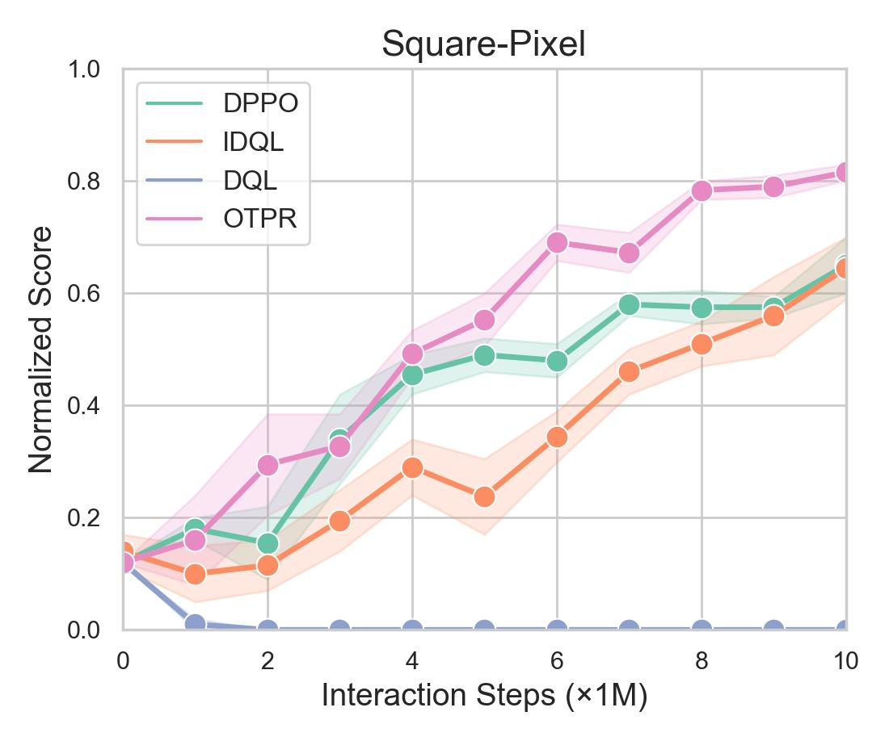
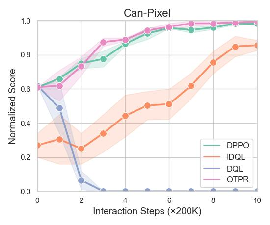

# 1. Qualitative Experiments
## Optimal Transport Guided Pair
Figure 1.1 (left) (right)

## Compatibility Function Guided Diffusion
Figure 1.2 Illustration of the 8gaussians and swissroll dataset (left) and the generation result of diffusion model (right).

# 2. Pixel-based Romomimic Tasks
Figure 2 

# 3. Reporting of Wall-Clock Times
|     | OTPR | DPPO     | IDQL| DQL |
| :---        |    :----:   |          :---: |   :---: | ---: |
| Robomimic-Can     | 26.5min      | 24.6min   | 23.3min| 21.2min |
| Robomimic-Square   | 54.4min        | 50.8min      | 49.2min| 50.3min |
<!-- | Franka-Kitchen-complete   | 75.4min      | 67.8min  | 67.1min | 64.1min | -->